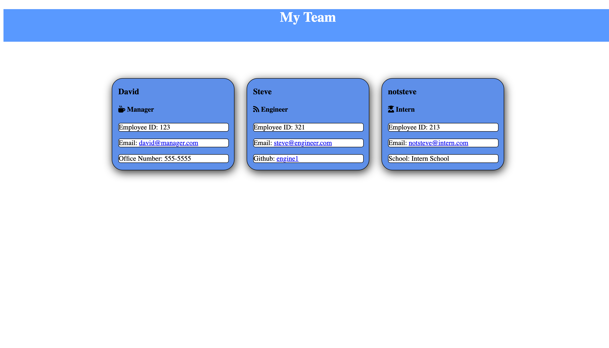

## 

# Team-Profile-Generator

## Description
### Team Profile Generator assists in the creation of a web page to display the employees in your company. Just fill in the prompts with the people on your team!

 

## Installation
### Clone this repository then once on the command line do the following commands
- npm init
- npm install inquirer
- npm install inquirer-loop
  
 

## Walkthrough Video
https://watch.screencastify.com/v/JA85BSGBuuB7IUb670QC

## Screenshot

 

## Usage
### On the command line type the following command 
- node index.js.
#### This will bring up prompts to allow you to add the employees on your team.

 

## Questions
For any questions please feel free to contact me via one of the methods below.

### Github: Github.com/JRera1796
### Email: RiveraJose1796@gmail.com
  
